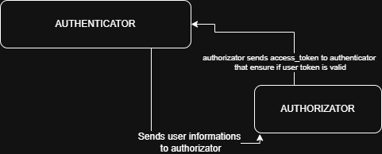

## 🚀 Getting Started

### Prerequisites

- PHP **8.2+**
- [Composer](https://getcomposer.org/)
- Laravel **12+**
- [Postman](https://www.postman.com/) (or other API client)
- A access token OAuth2 Bearer

---

### 🛠️ Installation

```bash
composer install
cp .env.example .env
php artisan key:generate
```
---
## Running Laravel Migrations

To create the necessary database tables, run the following command:

```bash
php artisan migrate
```
## Database Structure (Created by Migrations)

The following tables will be created when you run the migrations:

### `permissions`
| Column      | Type      | Description               |
|-------------|-----------|---------------------------|
| id          | BIGINT    | Primary key               |
| name        | VARCHAR   | Permission name (unique)  |

### `permissions_by_user`
| Column        | Type      | Description                        |
|---------------|-----------|------------------------------------|
| id            | BIGINT    | Primary key                        |
| user_id       | BIGINT    | Foreign key → `users.id`           |
| permission_id | BIGINT    | Foreign key → `permissions.id`     |

> 💡 These relationships are used to manage which users have access to specific permissions.

## Database Seeders

After running the migrations, you can populate the database with default data using Laravel seeders.

### Permissions Seeder

This seeder inserts a default set of permissions into the `permissions` table:

| Permission Name |
|-----------------|
| index           |
| store           |
| show            |
| update          |
| destroy         |

These permissions are commonly used in RESTful APIs to control access to actions such as listing, creating, viewing, updating, and deleting resources.

### Run the Seeders

To execute the seeders and populate the database:

```bash
php artisan db:seed
```


## Running the Server
To start the Laravel development server, run:

```bash
php artisan serve
```

## Application Ports

By default, each Laravel-based service runs on a different port (address server and port localizated in .env file):

| Service        | Default Port | .env Variable                     |
|----------------|--------------|----------------------------------|
| Authenticator  | `8000`       | `AUTHENTICATOR`                  |

To run each project on a specific port, use the `--port` flag when starting the Laravel server:

```bash
php artisan serve --port=8001
```
---

## 📘 API Documentation

### Authentication and Route Protection

All API routes are protected using **OAuth2 Bearer tokens**.

To obtain a valid token, please use the authentication project available at:

[php-laravel-authenticator](https://github.com/fabionunespedro/php-laravel-authenticator)

---

### Get Permissions
```http
GET /api/getPermissions
```
Grant permissions and returns a permissions list in case of success.
<br>

**Header (JSON)**
```http
Authorization: Bearer your_access_token
```
| Code     | Meaning  |
| -------- | -------  |
| 200      |Success (returns token)|
| 401     | Unauthorized (invalid token)|

---
# Postman Collection
> [Download authorizator API collection](docs/Autorizador.postman_collection.json)

---


